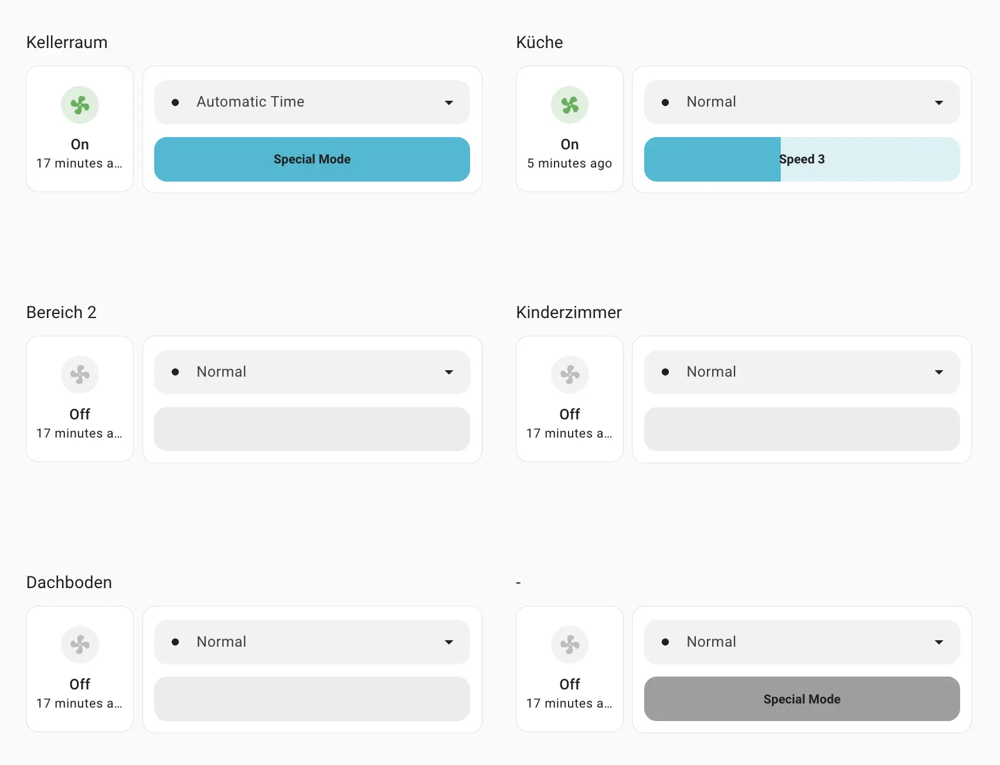
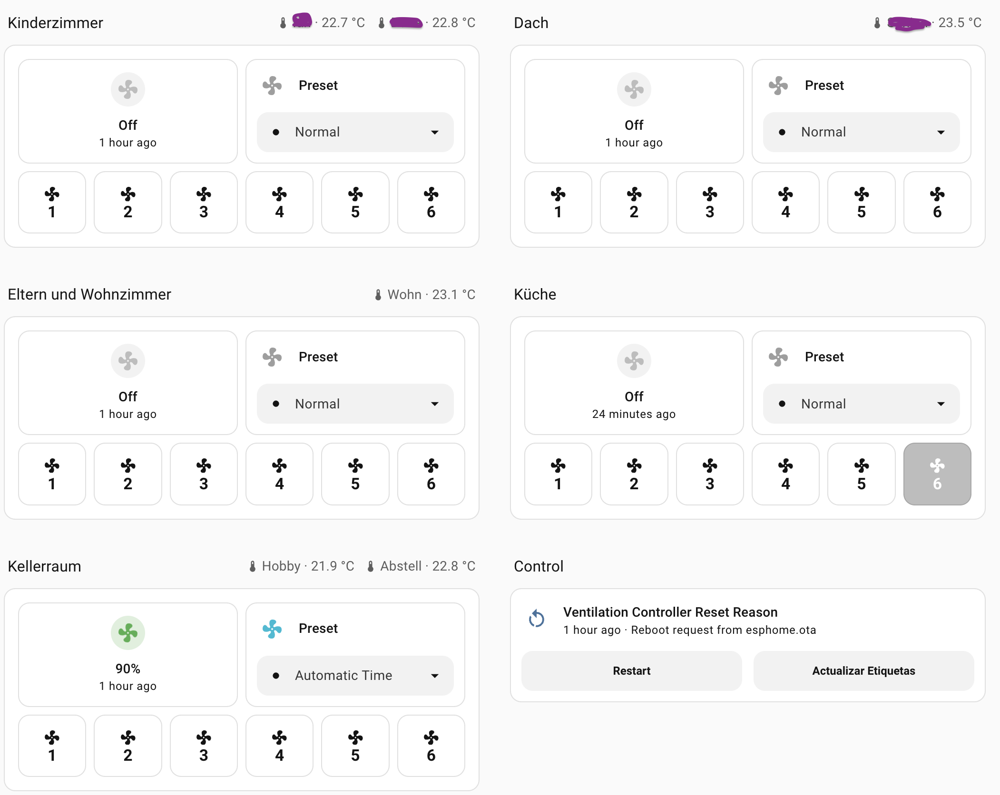

# Home Assistant

Home assistant has the problem that all fans show their speed as percentage. But we do not have percentage values, we have levels from `0` to `11`. From which some of those values are special ones.

HA reports the `percentage` attribute as a **truncated integer**: `floor(level / speed_count * 100)`. With [`split_special_modes`](readme.md#bulb-split-special-modes-recommended) enabled (`speed_count: 6`) the six levels map to **16, 33, 50, 66, 83, 100 %**. Without it (`speed_count: 11`) levels 1–6 map to **9, 18, 27, 36, 45, 54 %**. Use these exact values when matching `entity.attributes.percentage` in custom cards.

Selecting presets will carry the fan speed/percent to their corresponding level. In legacy mode, going into `NORMAL` mode will put the speed to 1. With [`split_special_modes`](readme.md#bulb-split-special-modes-recommended) enabled, selecting `Normal` preserves the current slider level when it is already within `1`-`6`, and only clamps invalid values into that range.

**For a better HA experience, enable [`split_special_modes`](readme.md#bulb-split-special-modes-recommended)** on the fan — this limits the slider to levels 1–6 and keeps special modes 7–11 accessible via the preset dropdown. See the example below under [`examples/split-mode.yaml`](examples/split-mode.yaml).

If you prefer full control you can also build a custom card (examples below).

## Custom HA Cards

### Slider Card
Here I am using [lovelace-mushroom](https://github.com/piitaya/lovelace-mushroom), [lovelace-card-mod](https://github.com/thomasloven/lovelace-card-mod) and [service-call-tile-feature](https://github.com/Nerwyn/service-call-tile-feature). On a Sections board.

If you are using the configuration written above, you just need to search and replace `fan_1` with the corresponding fan number to get more cards.

<div class="text-center">
  
</div>

<details>
  <summary>Click to see the Slider Card Code</summary>

  ```yaml
type: grid
cards:
  - type: heading
    heading_style: title
    heading: Heading
    card_mod:
      style: |
        .container .title {
           color: transparent !important;
        }

        .container .title:after {
          content: "{{ states('sensor.esp_ventilation_controller_label_fan_1') }}";
          position: absolute;
          left: 0px;
          color: var(--primary-text-color);
        }
  - type: custom:mushroom-fan-card
    entity: fan.esp_ventilation_controller_fan_1
    show_percentage_control: false
    fill_container: false
    icon_animation: true
    collapsible_controls: false
    secondary_info: last-updated
    primary_info: state
    grid_options:
      columns: 3
      rows: 2
    layout: vertical
    hold_action:
      action: more-info
    card_mod:
      style:
        mushroom-state-info$: |
          .primary {
            color: transparent !important;
            position: relative;
          }
          .primary:after {
            content: "{{ 'Unknown' if state_attr('fan.esp_ventilation_controller_fan_1', 'percentage') | int(0) == 255 else 'Off' if states('fan.esp_ventilation_controller_fan_1') == 'off' else 'On' }}";
            position: absolute;
            left: 0px;
            color: var(--primary-text-color);
            width:100%
          }
  - features:
      - style: dropdown
        type: fan-preset-modes
      - type: custom:service-call
        entries:
          - type: slider
            entity_id: fan.esp_ventilation_controller_fan_1
            range:
              - 9.09
              - 54.55
            tap_action:
              action: perform-action
              target:
                entity_id:
                  - fan.esp_ventilation_controller_fan_1
              confirmation: false
              perform_action: fan.set_percentage
              data:
                percentage: |
                  {{ value | int  }} 
            step: 9.090909090909092
            unit_of_measurement: U
            label: >-
              

              
                  Off
              
                  Speed {{ ((percentage / 100) * 10) | round(0, 'floor') + 1 }}
              
                  Special Mode
              
            value_attribute: percentage
            autofill_entity_id: true
            thumb: flat
    type: tile
    entity: fan.esp_ventilation_controller_fan_1
    grid_options:
      columns: 9
      rows: 3
    icon_tap_action:
      action: none
    tap_action:
      action: none
    hold_action:
      action: none
    card_mod:
      style: |
        ha-card {
         height: auto !important;
        }
        .container .content {
          padding-bottom: 4px;  
        }
        .container .content > *{
          display:none;
        }
column_span: 1

```

</details>


### Button Card
Here I am also Including the [decluttering-card](https://github.com/custom-cards/decluttering-card) and the extension of the Slider Card. The headers are standard Home Assistant Heading cards.

> **Two-part setup:** Step 1 registers the shared `sec_touch_fan_button` template in your HA `button_card_templates` config (once, globally). Step 2 is the `decluttering-card` template that uses it — each fan button shrinks to just its name and percentage.

<div class="text-center">
  
</div>

<details>
  <summary>Step 1 — Add to your HA button_card_templates config (once)</summary>

```yaml
button_card_templates:
  sec_touch_fan_button:
    icon: mdi:fan
    tap_action:
      action: call-service
      service: fan.set_percentage
      data:
        entity_id: '[[[ return entity.entity_id; ]]]'
        percentage: '[[[ return variables.pct; ]]]'
    styles:
      card:
        - border-radius: 12px
        - padding: 12px
        - font-weight: bold
        - background-color: |
            [[[
              if (entity.state === 'off' && entity.attributes.percentage === variables.pct) {
                return 'var(--disabled-color)';
              }
              const isActive = entity.attributes.percentage === variables.pct &&
                               entity.attributes.preset_mode === 'Normal';
              return isActive ? 'var(--accent-color)' : 'var(--card-background-color)';
            ]]]
      icon:
        - color: |
            [[[
              const isActive = entity.attributes.percentage === variables.pct &&
                               entity.attributes.preset_mode === 'Normal';
              return isActive ? 'white' : 'var(--primary-text-color)';
            ]]]
      name:
        - color: |
            [[[
              const isActive = entity.attributes.percentage === variables.pct &&
                               entity.attributes.preset_mode === 'Normal';
              return isActive ? 'white' : 'var(--primary-text-color)';
            ]]]
```

</details>

<details>
  <summary>Step 2 — Decluttering card template (WITHOUT split special modes)</summary>

```yaml
sec_touch_fan_control_template:
  card:
    square: false
    type: grid
    columns: 1
    cards:
      - type: horizontal-stack
        cards:
          - type: custom:mushroom-fan-card
            entity: '[[FAN_ENTITY_ID]]'
            show_percentage_control: false
            fill_container: true
            icon_animation: true
            collapsible_controls: false
            secondary_info: last-updated
            primary_info: state
            layout: vertical
            hold_action:
              action: more-info
          - features:
              - type: fan-preset-modes
                style: dropdown
            type: tile
            entity: '[[FAN_ENTITY_ID]]'
            features_position: bottom
            vertical: false
            tap_action:
              action: none
            hide_state: true
            name: Preset
            icon_tap_action:
              action: none
      - square: false
        type: grid
        columns: 6
        cards:
          - type: custom:button-card
            template: sec_touch_fan_button
            name: '1'
            entity: '[[FAN_ENTITY_ID]]'
            variables:
              pct: 9
          - type: custom:button-card
            template: sec_touch_fan_button
            name: '2'
            entity: '[[FAN_ENTITY_ID]]'
            variables:
              pct: 18
          - type: custom:button-card
            template: sec_touch_fan_button
            name: '3'
            entity: '[[FAN_ENTITY_ID]]'
            variables:
              pct: 27
          - type: custom:button-card
            template: sec_touch_fan_button
            name: '4'
            entity: '[[FAN_ENTITY_ID]]'
            variables:
              pct: 36
          - type: custom:button-card
            template: sec_touch_fan_button
            name: '5'
            entity: '[[FAN_ENTITY_ID]]'
            variables:
              pct: 45
          - type: custom:button-card
            template: sec_touch_fan_button
            name: '6'
            entity: '[[FAN_ENTITY_ID]]'
            variables:
              pct: 54

```

</details>

<details>
  <summary>Step 2 — Decluttering card template (WITH split special modes)</summary>

```yaml
sec_touch_fan_control_template:
  card:
    square: false
    type: grid
    columns: 1
    cards:
      - type: horizontal-stack
        cards:
          - type: custom:mushroom-fan-card
            entity: '[[FAN_ENTITY_ID]]'
            show_percentage_control: false
            fill_container: true
            icon_animation: true
            collapsible_controls: false
            secondary_info: last-updated
            primary_info: state
            layout: vertical
            hold_action:
              action: more-info
          - features:
              - type: fan-preset-modes
                style: dropdown
            type: tile
            entity: '[[FAN_ENTITY_ID]]'
            features_position: bottom
            vertical: false
            tap_action:
              action: none
            hide_state: true
            name: Preset
            icon_tap_action:
              action: none
      - square: false
        type: grid
        columns: 6
        cards:
          - type: custom:button-card
            template: sec_touch_fan_button
            name: '1'
            entity: '[[FAN_ENTITY_ID]]'
            variables:
              pct: 16
          - type: custom:button-card
            template: sec_touch_fan_button
            name: '2'
            entity: '[[FAN_ENTITY_ID]]'
            variables:
              pct: 33
          - type: custom:button-card
            template: sec_touch_fan_button
            name: '3'
            entity: '[[FAN_ENTITY_ID]]'
            variables:
              pct: 50
          - type: custom:button-card
            template: sec_touch_fan_button
            name: '4'
            entity: '[[FAN_ENTITY_ID]]'
            variables:
              pct: 66
          - type: custom:button-card
            template: sec_touch_fan_button
            name: '5'
            entity: '[[FAN_ENTITY_ID]]'
            variables:
              pct: 83
          - type: custom:button-card
            template: sec_touch_fan_button
            name: '6'
            entity: '[[FAN_ENTITY_ID]]'
            variables:
              pct: 100

```

</details>

<details>
  <summary>Click to see the Button Card Usage Code</summary>

```yaml
type: custom:decluttering-card
template: sec_touch_fan_control_template
variables:
  - FAN_ENTITY_ID: fan.esp_ventilation_controller_dachboden
  - TITLE: Dach
card_mod:
  style: |
    div#root {
      background: var(--ha-card-background,var(--card-background-color,#fff));
      padding: 1em;
      border-radius: var(--ha-card-border-radius, 12px);
      border-width: var(--ha-card-border-width, 1px);
      border-color: var(--ha-card-border-color, var(--divider-color, #e0e0e0));
      border-style: solid;
    }
      background: var(--ha-card-background,var(--card-background-color,#fff));
      padding: 1em;
      border-radius: var(--ha-card-border-radius, 12px);
      border-width: var(--ha-card-border-width, 1px);
    }

```
</details>
