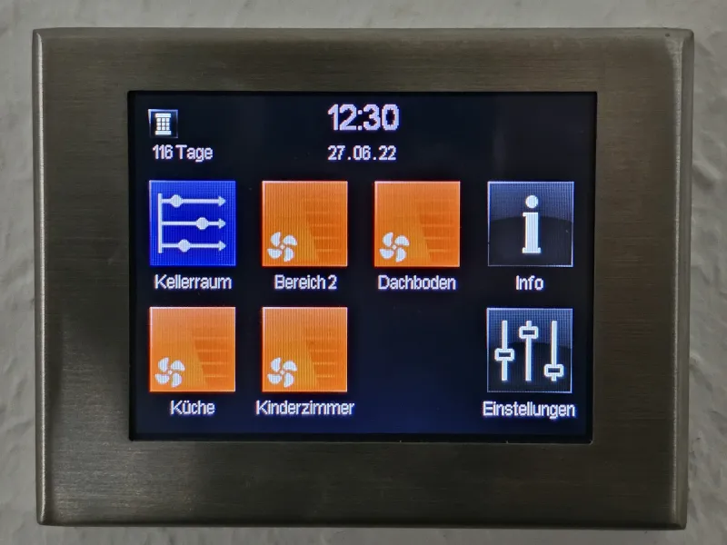
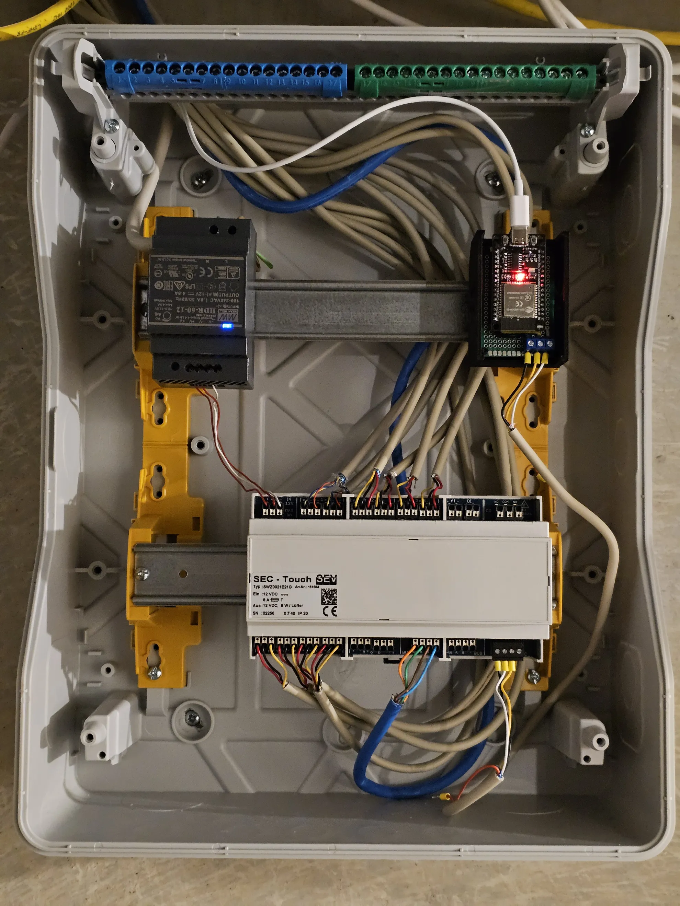

# SEC-TOUCH ESPHome Component
This is a component that allows you to control your SEC-TOUCH ventilation controller (Dezentrale Lüftung Zentralregler SEC-Touch) from your ESP device and integrate it to Home Assistant.

<div class="text-center">
  
<div>

(For now) It is limited to change the level of the fan pairs, or put them into their special modes (automatic, time, etc). There is no way to change the timing intervals for now. You need to make that in the SEC-TOUCH device itself.


## First of all thanks to:

- [Manuel Siekmann](https://github.com/Manuel-Siekmann/) who did the heavy lifting of find out the communication protocol of the SEC-TOUCH device in his [VentilationSystem](https://github.com/Manuel-Siekmann/VentilationSystem) project.
- [Samuel Sieb](https://github.com/ssieb) who helped me to understand some basic c++ and ESPHome concepts and responded my questions on Discord.

# Do it at your own Risk! 

The SEC-Touch has no open API or documentation for their UART interfaces, so I can no and DO NOT offer any warranty, everything here is reverse engineered. I have no affiliation with the company that produces the SEC-TOUCH device.

If you decide to use this component a **fan damage can not be ruled out**. **You** are the only responsible in case something goes wrong. 

Yes Really.

# Connection

The SEC-TOUCH has an "PC" port at the right bottom part. It has an `3.x` volts output. It worked to power my ESP32 device when I was using Software UART, but when I switched to Hardware UART it didn't work anymore. When I measured the voltage it was around `3.2v` tops.

I recommend you to power your ESP32 device using another source.

That said, probably it has enough power for an ESP8266 device that uses software UART.

### ESP8266 connection


### ESP32 cable connection (using external power )
The same but without the 3.3v connection. 😬
```
GPIO17 --> RX SEC-TOUCH
GPIO16 --> TX SEC-TOUCH
GND    --> GND SEC-TOUCH
```

## Final Installation



# Configuration:

Add this to `your-device.yaml` file:
```yaml

external_components:
  - source:
      type: git
      url: https://github.com/distante/esphome-components
      ref: main

wifi:
  ssid: !secret wifi_ssid 
  password: !secret wifi_password

  # Enable fallback hotspot (captive portal) in case wifi connection fails
  ap:
    ssid: "Ventilation-Controller"
    password: "supersecretpassword"

captive_portal:


web_server:
  port: 80
  local: true
  log: false
  version: 3
  sorting_groups:
    - id: group_1
      name: Fan Group 1
      sorting_weight: -100
    - id: group_2
      name: Fan Group 2
      sorting_weight: -99
    - id: group_3
      name: Fan Group 3
      sorting_weight: -98
    - id: group_4
      name: Fan Group 4
      sorting_weight: -97
    - id: group_5
      name: Fan Group 5
      sorting_weight: -96
    - id: group_6
      name: Fan Group 6
      sorting_weight: -95
    - id: group_settings
      name: Configuration
      sorting_weight: -94
  
uart:
  id: sec_touch_uart
  tx_pin: 
    number: GPIO17
  rx_pin:
    number: GPIO16
  baud_rate: 28800

sec_touch:
  uart_id: sec_touch_uart
  update_interval: 5s # 5s is the default

fan:
  - platform: sec_touch
    icon: "mdi:fan"
    fan_number: 1
    name: "Fan 1"
    web_server:
      sorting_group_id: group_1
  - platform: sec_touch
    icon: "mdi:fan"
    fan_number: 2
    name: "Fan 2"
    web_server:
      sorting_group_id: group_2
  - platform: sec_touch
    icon: "mdi:fan"
    fan_number: 3
    name: "Fan 3"
    web_server:
      sorting_group_id: group_3
  - platform: sec_touch
    icon: "mdi:fan"
    fan_number: 4
    name: "Fan 4"
    web_server:
      sorting_group_id: group_4
  - platform: sec_touch
    icon: "mdi:fan"
    fan_number: 5
    name: "Fan 5"
    web_server:
      sorting_group_id: group_5
  - platform: sec_touch
    icon: "mdi:fan"
    fan_number: 6
    name: "Fan 6"
    web_server:
      sorting_group_id: group_6


button:
  - platform: sec_touch
    program_text_update:
      name: "Program Labels Update"
      icon: "mdi:book-refresh"
  - platform: restart
    name: "Restart"
    
text_sensor:
  - platform: sec_touch
    fan_number: 1
    label_text:
      name: "Label Fan 1"
      web_server:
        sorting_group_id: group_1
    mode_text:
      name: "Mode Fan 1"
      web_server:
        sorting_group_id: group_1
  - platform: sec_touch
    fan_number: 2
    label_text:
      name: "Label Fan 2"
      web_server:
        sorting_group_id: group_2
    mode_text:
      name: "Mode Fan 2"
      web_server:
        sorting_group_id: group_2
  - platform: sec_touch
    fan_number: 3
    label_text:
      name: "Label Fan 3"
      web_server:
        sorting_group_id: group_3
    mode_text:
      name: "Mode Fan 3"
      web_server:
        sorting_group_id: group_3
  - platform: sec_touch
    fan_number: 4
    label_text:
      name: "Label Fan 4"
      web_server:
        sorting_group_id: group_4
    mode_text:
      name: "Mode Fan 4"
      web_server:
        sorting_group_id: group_4
  - platform: sec_touch
    fan_number: 5
    label_text:
      name: "Label Fan 5"
      web_server:
        sorting_group_id: group_5
    mode_text:
      name: "Mode Fan 5"
      web_server:
        sorting_group_id: group_5
  - platform: sec_touch
    fan_number: 6
    label_text:
      name: "Label Fan 6"
      web_server:
        sorting_group_id: group_6
    mode_text:
      name: "Mode Fan 6"
      web_server:
        sorting_group_id: group_6

```

Notice that the fans numbers are ordered so:

|   --   |   --   |   --   |   --   |
|--------|--------|--------|----|
| Pair 1 | Pair 3 | Pair 5 | ℹ️ |
| Pair 2 | Pair 4 | Pair 6 | ⚙️  |


## :bulb: Setting The Fan Level above 6
Please check the [Special Fan level Values](#fan-pair-level-special-values) section to understand the special values for the fan level.

# Home Assistant
Home assistant has the problem that all fans show their speed as percentage. But we do not have percentage values, we have levels from `0` to `11`. From which some of those values are special ones.

For now we have to "live with" that, selecting presets will carry the fan speed/percent to their corresponding level, but going into `NORMAL` mode will put the speed to 1. I would recommend to use a button card with all the states instead of the fan one until this can be fixed.

```yaml

# Development

# Known Ids
## Command Ids
```
SET: 32
GET: 32800
```
## Fan Pair Level
Stored on `FAN_LEVEL_IDS` array as: 
```
173, 174, 175, 176, 177, 178
```
## Fan Pair Label/Name
Stored on `FAN_LABEL_IDS` array as: 

```
78, 79, 80, 81, 82, 83
```
---
### ⚠️ ID Mapping to Hardware Fan Pair
The Fan pairs are ordered from top to bottom, and left to right.

|   --   |   --   |   --   |   --   |
|--------|--------|--------|----|
| Level 173 | Level 175 | Level 177 | ℹ️ |
| Level 174 | Level 176 | Level 178 | ⚙️  |


# Fan Pair Level special values
Each Fan Pair can have a level from `0` to `11`. There, just `0` to `6` are _"real"_ levels, `7` to `11` are _"special"_ levels. A Level of `255` means there is not fan in that pair.

| Level    | Meaning  |
|----------|----------|
| 7        | Burst Ventilation / Stosslüften      |
| 8        | Automatic Humidity / Automatik Feuchte      |
| 9        | Automatic CO2 / Automatik CO2      |
| 10       | Automatic Time / Automatik Zeit      |
| 11       | Sleep / Schlummer      |
| 255      | Not Connected      |


# UART Messages
### GET Request Message
The structure of the GET Message is as follows  (special chars added manually):
```
[STX]32800[TAB]173[TAB]54142[ETX]
```

where:
- `32800` is the command id for a GET request.
- `173` is the property id of the fan pair.
- `54142` is the checksum.

### GET Response Message

After a GET request message is sent, the SEC-TOUCH sends two messages backs, an `ACK` and the response of our request. This is how the full returned buffer looks like (special chars added manually):
```log
[STX][ACK][ETX][STX]32[TAB]178[TAB]7[TAB]32627[ETX]
```
Where:
- `32` is (probably) the command id that can be used to set the level of the fan pair.
- `178` is the property id of the fan pair.
- `7` is the value assigned to that id.
- `32627` is the checksum(?).


```log
Byte received: 2   // STX 0x02
Byte received: 6   // ACK 0x06
Byte received: 10  // ETX 0x0A
Byte received: 2   // STX 0x02
Byte received: 51  // event_type?
Byte received: 50  // event_type?
Byte received: 9   // TAB 0x09
Byte received: 49  // id
Byte received: 55  // id
Byte received: 51  // id
Byte received: 9   // TAB 0x09
Byte received: 49  // value
Byte received: 48  // value
Byte received: 99  // TAB 0x09
Byte received: 52  // checksum?
Byte received: 50  // checksum?
Byte received: 54  // checksum?
Byte received: 57  // checksum?
Byte received: 54  // checksum?
Byte received: 10  // ETX 0x0A
Buffer: 
32	173	10	42696

```
---

:bulb: The Device expects for us to send an ACK after receiving that data.

---

:bulb: Sometimes we get an single `255` input value, we discard it as noise.

---

### SET Request Message
The structure of the SET Message is as follows  (special chars added manually):
```log
[STX]32[TAB]173[TAB]5[TAB]42625[ETX]
```

where:
- `32` is the command id for a SET request.
- `173` is the property id of the fan pair.
- `5` is the value assigned to that id.
- `42625` is the checksum.
- 
### SET Response Message
Sadly (IMHO) the SEC-TOUCH just sends an `ACK` message after receiving a SET message and sometimes it takes a couple of seconds for the SEC-TOUCH screen to update the new value, so the best we can do is to wait for the `ACK` message and then send a `GET` message to do a security sync of the new value.

```log
Byte received: 2   // STX 0x02
Byte received: 6   // ACK 0x06
Byte received: 10  // ETX 0x0A
```


### Update submodules
```
git submodule update --remote --merge
```