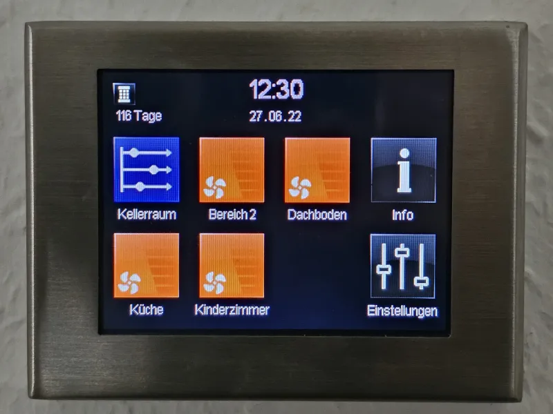
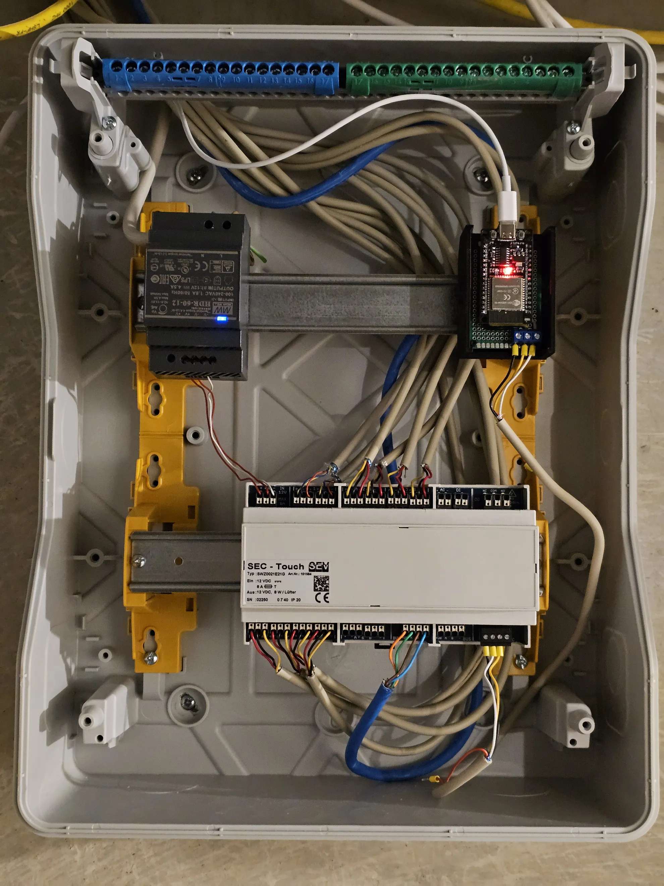
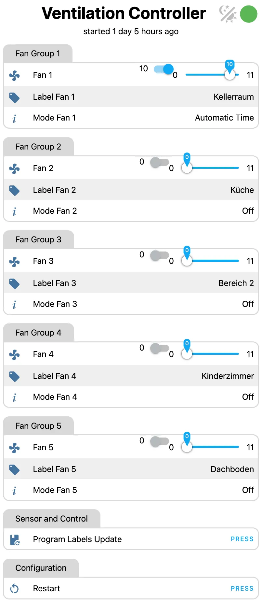

# SEC-TOUCH ESPHome Component
This is a component that allows you to control your SEC-TOUCH ventilation controller (Dezentrale Lüftung Zentralregler SEC-Touch) from your ESP device and integrate it to Home Assistant.

<div class="text-center">
  
</div>

(For now) It is limited to change the level of the fan pairs, or put them into their special modes (automatic, time, etc). There is no way to change the timing intervals for now. You need to make that in the SEC-TOUCH device itself.

The SEC-Touch device is always the source of true. No fan state restoration is done after a power loss.

## First of all thanks to:

- [Manuel Siekmann](https://github.com/Manuel-Siekmann/) who did the heavy lifting of find out the communication protocol of the SEC-TOUCH device in his [VentilationSystem](https://github.com/Manuel-Siekmann/VentilationSystem) project.
- [Samuel Sieb](https://github.com/ssieb) who helped me to understand some basic c++ and ESPHome concepts and responded my questions on Discord.

# Do it at your own Risk! 

The SEC-Touch has no open API or documentation for their UART interfaces, so I can no and DO NOT offer any warranty, everything here is reverse engineered. I have no affiliation with the company that produces the SEC-TOUCH device nor do I want this component to be used for financial gains. The only reason I developed this is because the official alternative is needs internet to works, which I do not want for a device that costs +200€ EURO.

If you decide to use this component a **fan damage can not be ruled out**. **You** are the only responsible in case something goes wrong. 

Yes Really.

# Hardware.

## Required
- An ESP32 or ESP8266 device.
  - I use [this one with USB C](https://amzn.to/4stOUoz).
- [4 Pin Pluggable Terminals](https://amzn.to/4jqp9kP)
- [4 core](https://amzn.to/3EK0uao) or [3 core cable](https://amzn.to/49e3jMB) (depending on how you can/want to power the ESP device)

## Optional
- [Breakout board](https://amzn.to/4aGkvwM) if you do not want to solder stuff
- [PCB board with header connectors](https://amzn.to/3YUpXos) if you want to solder everything (like I did, see bellow).
- [Din Rail Mounting clips](https://amzn.to/4aBUr5V) to mount the device if needed. 
  
# Connection

The SEC-TOUCH has an "PC" port at the right bottom part. It has an `3.x` volts output. It worked to power my ESP32 device when I was using Software UART, but when I switched to Hardware UART it didn't work anymore. When I measured the voltage it was around `3.2v` tops.

I recommend you to power your ESP32 device using another source.

That said, probably it has enough power for an ESP8266 device that uses software UART.

### ESP32 cable connection (using external power )
The same but without the 3.3v connection. 😬

|ESP32  | SEC-Touch| 
|--- | ---| 
|GND | GND (1st from the left)|
|GPIO 17 | RX (2nd from the left)| 
|GPIO 16 | TX (3rd from the left)|

### ESP8266 connection
<div class="text-center">
  
</div>

## Final Installation Example
<div class="text-center">
  
</div>


# Configuration:

Add this to `your-device.yaml` file:
```yaml

external_components:
  - source:
      type: git
      url: https://github.com/distante/esphome-components
      ref: stable

wifi:
  ssid: !secret wifi_ssid 
  password: !secret wifi_password

  # Enable fallback hotspot (captive portal) in case wifi connection fails
  ap:
    ssid: "Ventilation-Controller"
    password: "supersecretpassword"

captive_portal:


web_server:
  port: 80
  local: true
  log: false
  version: 3
  sorting_groups:
    - id: group_1
      name: Fan Group 1
      sorting_weight: -100
    - id: group_2
      name: Fan Group 2
      sorting_weight: -99
    - id: group_3
      name: Fan Group 3
      sorting_weight: -98
    - id: group_4
      name: Fan Group 4
      sorting_weight: -97
    - id: group_5
      name: Fan Group 5
      sorting_weight: -96
    - id: group_6
      name: Fan Group 6
      sorting_weight: -95
    - id: group_settings
      name: Configuration
      sorting_weight: -94
  
uart:
  id: sec_touch_uart
  tx_pin: 
    number: GPIO17
  rx_pin:
    number: GPIO16
  baud_rate: 28800

sec_touch:
  uart_id: sec_touch_uart
  update_interval: 5s # 5s is the default

fan:
  - platform: sec_touch
    icon: "mdi:fan"
    fan_number: 1
    name: "Fan 1"
    web_server:
      sorting_group_id: group_1
  - platform: sec_touch
    icon: "mdi:fan"
    fan_number: 2
    name: "Fan 2"
    web_server:
      sorting_group_id: group_2
  - platform: sec_touch
    icon: "mdi:fan"
    fan_number: 3
    name: "Fan 3"
    web_server:
      sorting_group_id: group_3
  - platform: sec_touch
    icon: "mdi:fan"
    fan_number: 4
    name: "Fan 4"
    web_server:
      sorting_group_id: group_4
  - platform: sec_touch
    icon: "mdi:fan"
    fan_number: 5
    name: "Fan 5"
    web_server:
      sorting_group_id: group_5
  - platform: sec_touch
    icon: "mdi:fan"
    fan_number: 6
    name: "Fan 6"
    web_server:
      sorting_group_id: group_6


button:
  - platform: sec_touch
    program_text_update:
      name: "Program Labels Update"
      icon: "mdi:book-refresh"
  - platform: restart
    name: "Restart"
    
text_sensor:
  - platform: sec_touch
    fan_number: 1
    label_text:
      name: "Label Fan 1"
      web_server:
        sorting_group_id: group_1
    mode_text:
      name: "Mode Fan 1"
      web_server:
        sorting_group_id: group_1
  - platform: sec_touch
    fan_number: 2
    label_text:
      name: "Label Fan 2"
      web_server:
        sorting_group_id: group_2
    mode_text:
      name: "Mode Fan 2"
      web_server:
        sorting_group_id: group_2
  - platform: sec_touch
    fan_number: 3
    label_text:
      name: "Label Fan 3"
      web_server:
        sorting_group_id: group_3
    mode_text:
      name: "Mode Fan 3"
      web_server:
        sorting_group_id: group_3
  - platform: sec_touch
    fan_number: 4
    label_text:
      name: "Label Fan 4"
      web_server:
        sorting_group_id: group_4
    mode_text:
      name: "Mode Fan 4"
      web_server:
        sorting_group_id: group_4
  - platform: sec_touch
    fan_number: 5
    label_text:
      name: "Label Fan 5"
      web_server:
        sorting_group_id: group_5
    mode_text:
      name: "Mode Fan 5"
      web_server:
        sorting_group_id: group_5
  - platform: sec_touch
    fan_number: 6
    label_text:
      name: "Label Fan 6"
      web_server:
        sorting_group_id: group_6
    mode_text:
      name: "Mode Fan 6"
      web_server:
        sorting_group_id: group_6

```

Notice that the fans numbers are ordered so:

|   --   |   --   |   --   |   --   |
|--------|--------|--------|----|
| Pair 1 | Pair 3 | Pair 5 | ℹ️ |
| Pair 2 | Pair 4 | Pair 6 | ⚙️  |


## Logging

Each component uses a distinct log tag. You can suppress noisy tags without hiding everything by adding a `logger` block to your YAML:

```yaml
logger:
  logs:
    sec_touch: WARN           # core component (polling loop, task queue, watchdog)
    sec_touch.uart: WARN      # raw UART sends/receives — very noisy at DEBUG
    sec_touch.incoming: WARN  # incoming message buffer (overflow warnings)
    sec_touch.fan: WARN       # fan entity state changes and control calls
    sec_touch.mode_select: WARN  # mode select entity
    sec_touch_sniffer: DEBUG  # sniffer discoveries and scan progress
```

| Tag | Component | Noisy at DEBUG? |
|---|---|---|
| `sec_touch` | Core component — loop, task queue, watchdog | Yes |
| `sec_touch.uart` | Raw UART sends/receives | Very |
| `sec_touch.incoming` | Incoming message buffer | Low |
| `sec_touch.fan` | Fan entity | Moderate |
| `sec_touch.mode_select` | Mode select entity | Low |
| `sec_touch_sniffer` | Sniffer (passive + active scan) | Moderate |

> **Tip:** When using the sniffer and you only want to see discovery output, set `sec_touch` and `sec_touch.uart` to `WARN` and `sec_touch_sniffer` to `INFO` or `DEBUG`.

## Sniffer

The sniffer listens for UART messages sent by the SEC-Touch for property IDs that no component has registered interest in. This lets you discover unknown property IDs for future use.

Two modes are available:

- **Passive** (always on): unknown IDs that arrive during normal polling are captured automatically.
- **Active scan** (optional): iterates through a configured range of property IDs, querying each one in turn. Normal polling is paused while scanning.

Results are published as a text sensor and visible in Home Assistant. An optional switch reflects whether a scan is currently running and can be toggled from Home Assistant.

> **Note:** Active scan is not recommended on ESP8266. Each discovered entry uses ~80–100 bytes of heap; a 200-ID scan uses ~20 KB against only ~40 KB of usable heap.

### Passive-only example

```yaml
text_sensor:
  - platform: sec_touch_sniffer
    sec_touch_id: sec_touch_component
    name: "Sniffer"
```

### Full example (with active scan)

```yaml
time:
  - platform: homeassistant
    id: ha_time

text_sensor:
  - platform: sec_touch_sniffer
    sec_touch_id: sec_touch_component
    name: "Sniffer"
    time_id: ha_time       # optional — uses device uptime when omitted
    scan_start: 1          # first property ID to query in active scan
    scan_end: 250          # last property ID to query; must be >= scan_start
    scan_switch:
      name: "Sniffer Scan Active"
```

Turning the switch on starts a scan from `scan_start`. Turning it off stops the scan immediately, publishes the results discovered so far, and saves the current position. Turning it on again resumes from where it left off. When the full range has been scanned, polling resumes automatically, the full result is published to the text sensor, and the switch turns off.

If a property ID does not respond within 2 seconds the scan retries it once. If it times out again the ID is skipped and a warning is logged.

### What I have found so far

Scan performed over IDs 1–208. IDs 78–83 (fan labels) and 173–178 (fan levels) are registered listeners and are excluded from the sniffer output — their meaning is already documented above.

**If you recognize a pattern or know what an ID controls, please open a PR or issue.**

<details>
<summary>Raw sniffer output (copy-paste ready)</summary>

```
1=23, 2=16, 3=0, 4=0, 5=100, 6=1, 7=1, 8=1, 9=0, 10=0, 11=0, 12=0, 13=0, 14=0, 15=0, 16=0, 17=0, 18=0, 19=80, 20=6, 21=16, 22=40, 23=32, 24=28, 25=25, 26=21, 27=0, 28=61, 29=70, 30=74, 31=77, 32=81, 33=100, 34=50, 35=50, 36=50, 37=50, 38=50, 39=50, 40=50, 41=50, 42=50, 43=50, 44=50, 45=50, 46=50, 47=75, 48=800, 49=1200, 50=400, 51=20, 52=70, 53=10, 54=20, 55=0, 56=127, 57=0, 58=1, 59=95, 60=1, 61=1, 62=1, 63=1, 64=1, 65=0, 66=1, 67=2, 68=3, 69=4, 70=5, 71=6, 72=0, 73=1, 74=1, 75=1, 76=1, 77=1, 83=0, 84=13, 85=0, 86=1, 87=0, 88=0, 89=0, 90=0, 91=0, 92=100, 93=74, 94=6, 95=0, 96=100, 97=250, 98=2000, 99=-50, 100=50, 101=18, 102=6, 103=11, 104=22, 105=9, 106=22, 107=0, 108=7, 109=4, 110=3, 111=0, 112=18, 113=13, 114=14, 115=7, 116=23, 117=7, 118=7, 119=0, 120=7, 121=2, 122=0, 123=0, 124=13, 125=14, 126=22, 127=4, 128=12, 129=7, 130=0, 131=1, 132=0, 133=0, 134=0, 135=13, 136=14, 137=20, 138=8, 139=12, 140=7, 141=0, 142=2, 143=0, 144=0, 145=0, 146=0, 147=23, 148=8, 149=15, 150=4, 151=7, 152=1, 153=1, 154=0, 155=7, 156=0, 157=6, 158=9, 159=15, 160=20, 161=22, 162=0, 163=0, 164=0, 165=0, 166=0, 167=0, 168=3, 169=0, 170=0, 171=0, 172=0, 176=0, 178=255, 179=127, 180=127, 181=127, 182=127, 183=127, 184=127, 185=36, 186=31, 187=27, 188=18, 189=10, 190=0, 191=64, 192=70, 194=85, 195=100, 196=0, 197=36, 198=31, 199=27, 200=23, 201=18, 202=10, 203=64, 204=70, 205=74, 206=80, 207=85, 208=100
```

</details>

<details>
<summary>ID analysis table (help wanted — fill in what you know)</summary>

> **IDs not in output:** 78–82 (fan pair labels, registered listener), 173–175, 177 (fan pair levels, registered listener), 193 (no response from device).

| ID | Value | Hypothesis | Confidence |
|----|-------|------------|------------|
| 1 | 23 | | |
| 2 | 16 | | |
| 3 | 0 | | |
| 4 | 0 | | |
| 5 | 100 | | |
| 6 | 1 | | |
| 7 | 1 | | |
| 8 | 1 | | |
| 9 | 0 | | |
| 10 | 0 | | |
| 11 | 0 | | |
| 12 | 0 | | |
| 13 | 0 | | |
| 14 | 0 | | |
| 15 | 0 | | |
| 16 | 0 | | |
| 17 | 0 | | |
| 18 | 0 | | |
| 19 | 80 | | |
| 20 | 6 | | |
| 21 | 16 | | |
| 22 | 40 | | |
| 23 | 32 | | |
| 24 | 28 | | |
| 25 | 25 | | |
| 26 | 21 | | |
| 27 | 0 | | |
| 28 | 61 | | |
| 29 | 70 | | |
| 30 | 74 | | |
| 31 | 77 | | |
| 32 | 81 | | |
| 33 | 100 | | |
| 34 | 50 | | |
| 35 | 50 | | |
| 36 | 50 | | |
| 37 | 50 | | |
| 38 | 50 | | |
| 39 | 50 | | |
| 40 | 50 | | |
| 41 | 50 | | |
| 42 | 50 | | |
| 43 | 50 | | |
| 44 | 50 | | |
| 45 | 50 | | |
| 46 | 50 | | |
| 47 | 75 | | |
| 48 | 800 | | |
| 49 | 1200 | | |
| 50 | 400 | | |
| 51 | 20 | | |
| 52 | 70 | | |
| 53 | 10 | | |
| 54 | 20 | | |
| 55 | 0 | | |
| 56 | 127 | | |
| 57 | 0 | | |
| 58 | 1 | | |
| 59 | 95 | | |
| 60 | 1 | | |
| 61 | 1 | | |
| 62 | 1 | | |
| 63 | 1 | | |
| 64 | 1 | | |
| 65 | 0 | | |
| 66 | 1 | | |
| 67 | 2 | | |
| 68 | 3 | | |
| 69 | 4 | | |
| 70 | 5 | | |
| 71 | 6 | | |
| 72 | 0 | | |
| 73 | 1 | | |
| 74 | 1 | | |
| 75 | 1 | | |
| 76 | 1 | | |
| 77 | 1 | | |
| 83 | 0 | | |
| 84 | 13 | | |
| 85 | 0 | | |
| 86 | 1 | | |
| 87 | 0 | | |
| 88 | 0 | | |
| 89 | 0 | | |
| 90 | 0 | | |
| 91 | 0 | | |
| 92 | 100 | | |
| 93 | 74 | | |
| 94 | 6 | | |
| 95 | 0 | | |
| 96 | 100 | | |
| 97 | 250 | | |
| 98 | 2000 | | |
| 99 | -50 | | |
| 100 | 50 | | |
| 101 | 18 | | |
| 102 | 6 | | |
| 103 | 11 | | |
| 104 | 22 | | |
| 105 | 9 | | |
| 106 | 22 | | |
| 107 | 0 | | |
| 108 | 7 | | |
| 109 | 4 | | |
| 110 | 3 | | |
| 111 | 0 | | |
| 112 | 18 | | |
| 113 | 13 | | |
| 114 | 14 | | |
| 115 | 7 | | |
| 116 | 23 | | |
| 117 | 7 | | |
| 118 | 7 | | |
| 119 | 0 | | |
| 120 | 7 | | |
| 121 | 2 | | |
| 122 | 0 | | |
| 123 | 0 | | |
| 124 | 13 | | |
| 125 | 14 | | |
| 126 | 22 | | |
| 127 | 4 | | |
| 128 | 12 | | |
| 129 | 7 | | |
| 130 | 0 | | |
| 131 | 1 | | |
| 132 | 0 | | |
| 133 | 0 | | |
| 134 | 0 | | |
| 135 | 13 | | |
| 136 | 14 | | |
| 137 | 20 | | |
| 138 | 8 | | |
| 139 | 12 | | |
| 140 | 7 | | |
| 141 | 0 | | |
| 142 | 2 | | |
| 143 | 0 | | |
| 144 | 0 | | |
| 145 | 0 | | |
| 146 | 0 | | |
| 147 | 23 | | |
| 148 | 8 | | |
| 149 | 15 | | |
| 150 | 4 | | |
| 151 | 7 | | |
| 152 | 1 | | |
| 153 | 1 | | |
| 154 | 0 | | |
| 155 | 7 | | |
| 156 | 0 | | |
| 157 | 6 | | |
| 158 | 9 | | |
| 159 | 15 | | |
| 160 | 20 | | |
| 161 | 22 | | |
| 162 | 0 | | |
| 163 | 0 | | |
| 164 | 0 | | |
| 165 | 0 | | |
| 166 | 0 | | |
| 167 | 0 | | |
| 168 | 3 | | |
| 169 | 0 | | |
| 170 | 0 | | |
| 171 | 0 | | |
| 172 | 0 | | |
| 176 | 0 | | |
| 178 | 255 | | |
| 179 | 127 | | |
| 180 | 127 | | |
| 181 | 127 | | |
| 182 | 127 | | |
| 183 | 127 | | |
| 184 | 127 | | |
| 185 | 36 | | |
| 186 | 31 | | |
| 187 | 27 | | |
| 188 | 18 | | |
| 189 | 10 | | |
| 190 | 0 | | |
| 191 | 64 | | |
| 192 | 70 | | |
| 194 | 85 | | |
| 195 | 100 | | |
| 196 | 0 | | |
| 197 | 36 | | |
| 198 | 31 | | |
| 199 | 27 | | |
| 200 | 23 | | |
| 201 | 18 | | |
| 202 | 10 | | |
| 203 | 64 | | |
| 204 | 70 | | |
| 205 | 74 | | |
| 206 | 80 | | |
| 207 | 85 | | |
| 208 | 100 | | |

</details>

---

## :bulb: Setting The Fan Level above 6
Please check the [Special Fan level Values](#fan-pair-level-special-values) section to understand the special values for the fan level.

## :bulb: Split Special Modes (recommended)
By default each fan entity exposes all 11 levels as a single continuous speed range.
Because levels 1–6 are _continuous ventilation_ but levels 7–11 are _discrete operating modes_
(Burst / Auto Humidity / Auto CO2 / Auto Time / Sleep), the default HA slider shows a linear
0–100 % range with 9.09 % steps — awkward to use and not visually distinguishable.

Enable `split_special_modes: true` on the fan to get a cleaner UX:

```yaml
fan:
  - platform: sec_touch
    fan_number: 1
    name: "Lüftung Büro"
    split_special_modes: true
```

With the flag enabled:

- The HA fan slider exposes **only speeds 1–6** (`speed_count: 6`), so each detent maps to one real ventilation level.
- Levels 7–11 remain reachable through the existing **preset_mode dropdown** (`Burst`, `Automatic Humidity`, `Automatic CO2`, `Automatic Time`, `Sleep`).
- The flag is **opt-in** and defaults to `false` — existing installations are unaffected.
- HA reports percentages as truncated integers (`floor(level / speed_count * 100)`), giving: **16, 33, 50, 66, 83, 100** for levels 1–6. Without the flag the values are **9, 18, 27, 36, 45, 54** (11-level range).

> :information_source: The preset dropdown is what HA already shows under the fan tile's
> "more info" view, or via the `fan-preset-modes` tile feature. It reads and writes the
> same underlying BDE level — `split_special_modes` just keeps the slider range sane.

> :warning: ESPHome's built-in `web_server` does **not** render fan `preset_mode` dropdowns.
> If you rely on the local web UI (e.g. non-HA fallback), add a `select.sec_touch` entity per fan
> to expose a clickable Mode dropdown. See [`examples/webserver-fallback.yaml`](examples/webserver-fallback.yaml).

# Web Server preview

<div class="text-center">
  
</div>

# Home Assistant

> For Home Assistant integration details, custom card examples, and tips for the best HA experience, see **[home_assistant.md](home_assistant.md)**.

# Development

# Known Ids
## Command Ids
```
SET: 32
GET: 32800
```
## Fan Pair Level
Stored on `FAN_LEVEL_IDS` array as: 
```
173, 174, 175, 176, 177, 178
```
## Fan Pair Label/Name
Stored on `FAN_LABEL_IDS` array as: 

```
78, 79, 80, 81, 82, 83
```
---
### ⚠️ ID Mapping to Hardware Fan Pair
The Fan pairs are ordered from top to bottom, and left to right.

|   --   |   --   |   --   |   --   |
|--------|--------|--------|----|
| Level 173 | Level 175 | Level 177 | ℹ️ |
| Level 174 | Level 176 | Level 178 | ⚙️  |


# Fan Pair Level special values
Each Fan Pair can have a level from `0` to `11`. There, just `0` to `6` are _"real"_ levels, `7` to `11` are _"special"_ levels. A Level of `255` means there is not fan in that pair.

| Level    | Meaning  |
|----------|----------|
| 7        | Burst Ventilation / Stosslüften      |
| 8        | Automatic Humidity / Automatik Feuchte      |
| 9        | Automatic CO2 / Automatik CO2      |
| 10       | Automatic Time / Automatik Zeit      |
| 11       | Sleep / Schlummer      |
| 255      | Not Connected      |


# UART Messages
### GET Request Message
The structure of the GET Message is as follows  (special chars added manually):
```
[STX]32800[TAB]173[TAB]54142[ETX]
```

where:
- `32800` is the command id for a GET request.
- `173` is the property id of the fan pair.
- `54142` is the checksum.

### GET Response Message

After a GET request message is sent, the SEC-TOUCH sends two messages backs, an `ACK` and the response of our request. This is how the full returned buffer looks like (special chars added manually):
```log
[STX][ACK][ETX][STX]32[TAB]178[TAB]7[TAB]32627[ETX]
```
Where:
- `32` is (probably) the command id that can be used to set the level of the fan pair.
- `178` is the property id of the fan pair.
- `7` is the value assigned to that id.
- `32627` is the checksum(?).


```log
Byte received: 2   // STX 0x02
Byte received: 6   // ACK 0x06
Byte received: 10  // ETX 0x0A
Byte received: 2   // STX 0x02
Byte received: 51  // event_type?
Byte received: 50  // event_type?
Byte received: 9   // TAB 0x09
Byte received: 49  // id
Byte received: 55  // id
Byte received: 51  // id
Byte received: 9   // TAB 0x09
Byte received: 49  // value
Byte received: 48  // value
Byte received: 99  // TAB 0x09
Byte received: 52  // checksum?
Byte received: 50  // checksum?
Byte received: 54  // checksum?
Byte received: 57  // checksum?
Byte received: 54  // checksum?
Byte received: 10  // ETX 0x0A
Buffer: 
32	173	10	42696

```
---

:bulb: The Device expects for us to send an ACK after receiving that data.

---

:bulb: Sometimes we get an single `255` input value, we discard it as noise.

---

### SET Request Message
The structure of the SET Message is as follows  (special chars added manually):
```log
[STX]32[TAB]173[TAB]5[TAB]42625[ETX]
```

where:
- `32` is the command id for a SET request.
- `173` is the property id of the fan pair.
- `5` is the value assigned to that id.
- `42625` is the checksum (probably).

### SET Response Message
Sadly (IMHO) the SEC-TOUCH just sends an `ACK` message after receiving a SET message and sometimes it takes a couple of seconds for the SEC-TOUCH screen to update the new value, so the best we can do is to wait for the `ACK` message and then send a `GET` message to do a security sync of the new value.

```log
Byte received: 2   // STX 0x02
Byte received: 6   // ACK 0x06
Byte received: 10  // ETX 0x0A
```

# Update submodules
```
git submodule update --remote --merge

```
